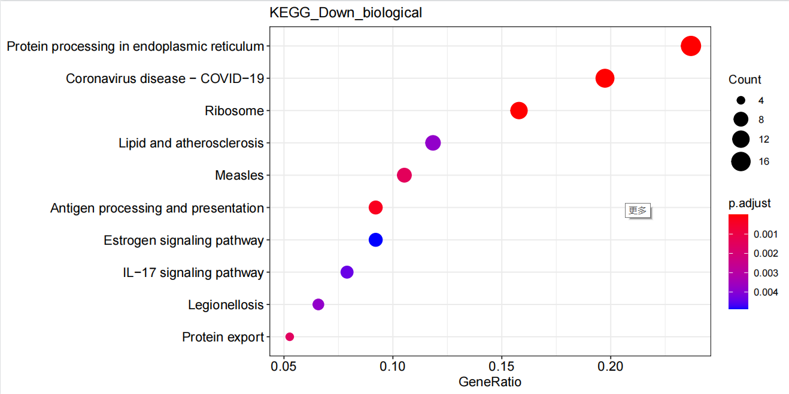
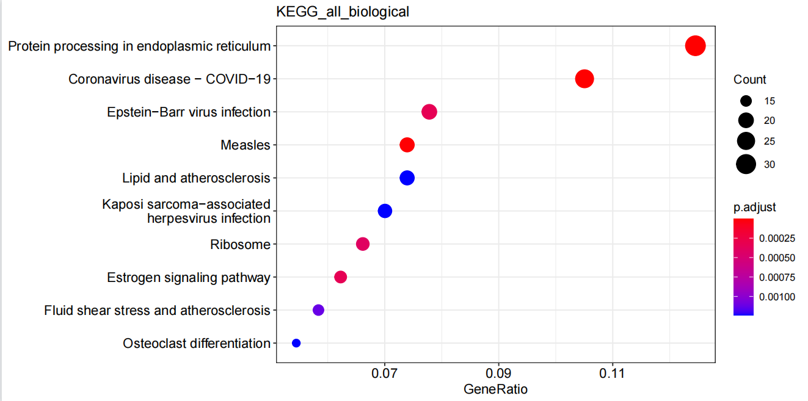
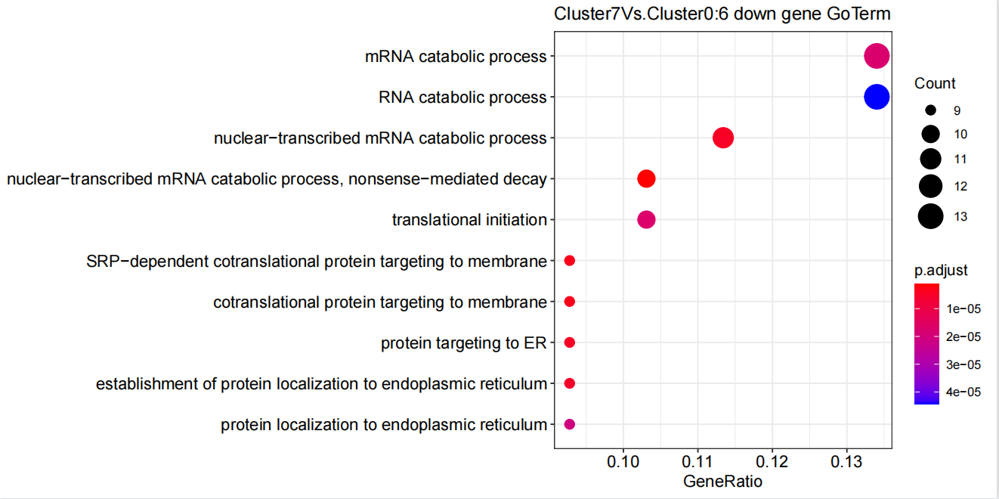

#10x分析流程
##数据来源与下载
| SRA号 | 样本名 |
| ---- |  ---- |
| SRR11955216 | Healthy 1 |
| SRR11955217 | Healthy 2 |
| SRR11955218 | Mild |
| SRR11955219 | Severe |
通过NCBI官方推荐的prefetch来下载数据：
```
prefetch --option-file SRR_lists.txt
```
##转为fastq文件
```
cat sample.txt | while read id
do 
fastq-dump --gzip --split-files -A $id ${id}.sra
done
```


这里只输出了两个文件, 但是看别的教程都是三个文件, 包含index,barcode+umi和reads,sample index那个文件不是必须的。
##修改fastq文件名
根据10x官网说明，在后续处理数据之前，要先更改fastq文件名：

```
cat sample.txt | while read id
do
mv ${id}_1.fastq.gz ${id}_S1_L001_R1_001.fastq.gz;
mv ${id}_2.fastq.gz ${id}_S1_L001_R2_001.fastq.gz;
done
```
##fastqc质量检测
```
find ./ -name '*R1*.gz' > id_1.txt
find ./ -name '*R2*.gz' > id_2.txt
cat id_1.txt id_2.txt > id_all.txt
cat id_all.txt | xargs fastqc -t 8 -o ./fastqc/
```
##cellranger
cellranger有多个流程，主要有4个流程 mkfastq、定量 count、组合 aggr、reanalyze。
如果是bcl原始测序数据，需用mkfastq转换为fastq格式(根据index将reads分配至不同的样本)。如果是fastq格式数据，则可直接用count命令定量，得到表达矩阵，然后用aggr命令整合样本(比如实验组有多个重复样本)，最后reanalyze进行后续降维聚类等等分析。


cellranger安装：
```
curl -o cellranger-6.1.2.tar.gz "https://cf.10xgenomics.com/releases/cell-exp/cellranger-6.1.2.tar.gz?Expires=1652123707&Policy=eyJTdGF0ZW1lbnQiOlt7IlJlc291cmNlIjoiaHR0cHM6Ly9jZi4xMHhnZW5vbWljcy5jb20vcmVsZWFzZXMvY2VsbC1leHAvY2VsbHJhbmdlci02LjEuMi50YXIuZ3oiLCJDb25kaXRpb24iOnsiRGF0ZUxlc3NUaGFuIjp7IkFXUzpFcG9jaFRpbWUiOjE2NTIxMjM3MDd9fX1dfQ__&Signature=UweLR-FqWO5mPRCQmE7Cf-C99SOE~Q3jcxhY~HxOBosPmxHtEKoJjbxJayMc1XMPYzT7a-NqDWJ7KsHA0fiSXlB~4RSwzttIxo4KdnOjNGUfA-crtsJAwUbxxy1gjYm6TRABNfQb8O1lM9Wm2u4o80y6uZgDy1Kf3DnVyta-Y3gaQjNzvOVEFPZB8jJk9Eed9rc6jH3l896a-8I6qNuyV5EgoqMnXiKA~Ke0ShK7TMHZjhXJjHOT2cDgbr1Tlz8UR8bwcUuewvtNlVm859SvFkoEPsBiHcOaaEz1vtIJHH709bplvIwtah3-OXdHl5ES5EafqkTi2sdGD-z0lcEhWg__&Key-Pair-Id=APKAI7S6A5RYOXBWRPDA"
```


下载参考基因组数据:
```
curl -O https://cf.10xgenomics.com/supp/cell-exp/refdata-gex-GRCh38-2020-A.tar.gz
```


count细胞定量
这个过程是最重要的，它完成细胞与基因的定量，它将比对、质控、定量都包装了起来:
```
cat sample.txt | while read id
do
cellranger count --id=${id} \
--fastqs=/public/workspace/stu19230111/singlecell/rawdata/data/ \
--sample=${id} \
--transcriptome=/public/workspace/stu19230111/singlecell/reference/refdata-gex-GRCh38-2020-A/
done
```

cellranger count结果解读[参阅](https://zhuanlan.zhihu.com/p/390516422)

得到cellranger分析结果后，下游我们需要将filtered_gene_bc_matrices 文件夹作为输入文件输入到seurat或者scanpy。
filtered_gene_bc_matrices 文件夹包含三个文件：barcodes.tsv；features.tsv；matrix.mtx

##多个10x单细胞对象的合并和批次校正：seurat读取+Harmony整合

healthy组

###一. 多个单细胞样本的合并
####1. 读取并合并数据
#####1.1 读取数据
```
assays <- dir("data1/")
names <- rep("/raw_feature_bc_matrix",length(assays))
dir <- paste0("data1/", assays)
dir <- paste0(dir,names)
# 按文件顺序给样本命名，名称不要以数字开头，中间不能有空格 samples_name = assays
```

#####1.2 批量创建seurat对象
```
scRNAlist <- list()
for(i in 1:length(dir)){
  counts <- Read10X(data.dir = dir[i])
  #不设置min.cells过滤基因会导致CellCycleScoring报错：
  #Insufficient data values to produce 24 bins.  
  scRNAlist[[i]] <- CreateSeuratObject(counts, project=samples_name[i],
                                       min.cells=3, min.features = 200)
  #给细胞barcode加个前缀，防止合并后barcode重名
  scRNAlist[[i]] <- RenameCells(scRNAlist[[i]], add.cell.id = samples_name[i])   
  #计算线粒体基因比例
  if(T){    
    scRNAlist[[i]][["percent.mt"]] <- PercentageFeatureSet(scRNAlist[[i]], pattern = "^MT-") 
  }
   #计算核糖体基因比例
   if(T){
     scRNAlist[[i]][["percent.rb"]] <- PercentageFeatureSet(scRNAlist[[i]], pattern = "^RP[SL]")
   }
   #计算红细胞基因比例
   if(T){
     HB.genes <- c("HBA1","HBA2","HBB","HBD","HBE1","HBG1","HBG2","HBM","HBQ1","HBZ")
     HB.genes <- CaseMatch(HB.genes, rownames(scRNAlist[[i]]))
     scRNAlist[[i]][["percent.HB"]]<-PercentageFeatureSet(scRNAlist[[i]], features=HB.genes) 
   }
}

### 给列表命名并保存数据
dir.create("Integrate")
setwd("./Integrate")

names(scRNAlist) <- samples_name
```

#####1.3 使用merge函数将scRNAlist合成一个Seurat对象
```
scRNA <- merge(scRNAlist[[1]], scRNAlist[2:length(scRNAlist)])
scRNA
# An object of class Seurat 
# 18818 features across 19738 samples within 1 assay 
# Active assay: RNA (18818 features, 0 variable features)
table(scRNA$orig.ident)
```

####2. 数据质控
#####质控前
```
theme.set2 = theme(axis.title.x=element_blank())
# 设置绘图元素
#plot.featrures = c("nFeature_RNA", "nCount_RNA", "percent.mt")
plot.featrures = c("nFeature_RNA", "nCount_RNA", "percent.mt", "percent.rb", "percent.HB")
group = "orig.ident"
# 质控前小提琴图
plots = list()
for(i in seq_along(plot.featrures)){
  plots[[i]] = VlnPlot(scRNA, group.by=group, pt.size = 0,
                       features = plot.featrures[i]) + theme.set2 + NoLegend()}
violin <- wrap_plots(plots = plots, nrow=2)    
dir.create("QC")
ggsave("QC/health_vlnplot_before_qc.pdf", plot = violin, width = 9, height = 8)
```

#####质控后
```
minGene=500
maxGene=6000
#maxUMI=15000
pctMT=15
#pctHB=1
### 数据质控并绘制小提琴图
scRNA <- subset(scRNA, subset =  nFeature_RNA > minGene & nFeature_RNA < maxGene & percent.mt < pctMT)
#scRNA <- subset(scRNA, subset = nCount_RNA < maxUMI & nFeature_RNA > minGene & 
#                  nFeature_RNA < maxGene & percent.mt < pctMT & percent.HB < pctHB)
plots = list()
for(i in seq_along(plot.featrures)){
  plots[[i]] = VlnPlot(scRNA, group.by=group, pt.size = 0,
                       features = plot.featrures[i]) + theme.set2 + NoLegend()}
violin <- wrap_plots(plots = plots, nrow=2)  
ggsave("QC/health_vlnplot_after_qc.pdf", plot = violin, width = 10, height = 8) 
```

####3. 查看批次效应（对merge后的Seurat对象进行标准化和降维）
```
scRNA <- subset(scRNA, subset = nCount_RNA < maxUMI & nFeature_RNA > minGene & 
                  nFeature_RNA < maxGene & percent.mt < pctMT & percent.HB < pctHB)
scRNA <- NormalizeData(scRNA) %>% FindVariableFeatures(nfeatures = 2000) %>% ScaleData()
scRNA <- RunPCA(scRNA, verbose = F)
ElbowPlot(scRNA, ndims = 50)
pc.num=1:30
scRNA <- scRNA %>% RunTSNE(dims=pc.num) %>% RunUMAP(dims=pc.num)
scRNA <- FindNeighbors(scRNA, dims=pc.num) %>% FindClusters()
p <- DimPlot(scRNA, label = T)
ggsave("health_UMAP_All.pdf", p, width = 8, height = 6)
p <- DimPlot(scRNA, group.by = "orig.ident")
ggsave("health_UMAP_Samples.pdf", p, width = 8, height = 6)
p <- DimPlot(scRNA, group.by = "orig.ident", split.by = "orig.ident", ncol = 4)
ggsave("health_UMAP_Samples_Split.pdf", p, width = 18, height = 12)
```


###二. 数据整合:harmony
```
scRNAlist <- SplitObject(scRNA, split.by = "orig.ident")
scRNA@meta.data$stim <- c(rep("health1", ncol(scRNAlist[[1]])), rep("health2", ncol(scRNAlist[[2]])))#赋值条件变量

#未经校正的PC中的数据集之间存在明显差异：
options(repr.plot.height = 5, repr.plot.width = 12) 
p1 <- DimPlot(object = scRNA, reduction = "pca", pt.size = .1, group.by = "stim") 
p2 <- VlnPlot(object = scRNA, features = "PC_1", group.by = "stim", pt.size = .1) 
pdf("health_harmony整合前.pdf")
plot_grid(p1,p2) 
dev.off()
###运行Harmony的最简单方法是传递Seurat对象并指定要集成的变量。RunHarmony返回Seurat对象，并使用更正后的Harmony坐标。让我们将plot_convergence设置为TRUE，这样我们就可以确保Harmony目标函数在每一轮中都变得更好。
options(repr.plot.height = 2.5, repr.plot.width = 6) 
scRNA <- scRNA %>% RunHarmony("stim", plot_convergence = TRUE) 
#要直接访问新的Harmony embeddings，请使用Embeddings命令。
harmony_embeddings <- Embeddings(scRNA, 'harmony') 
harmony_embeddings[1:5, 1:5]
#让我们查看确认数据集在Harmony运行之后的前两个维度中得到很好的整合。
options(repr.plot.height = 5, repr.plot.width = 12) 
p1 <- DimPlot(object = scRNA, reduction = "harmony", pt.size = .1, group.by = "stim") 
p2 <- VlnPlot(object = scRNA, features = "harmony_1", group.by = "stim", pt.size = .1) 
pdf("health_harmony整合后.pdf")
plot_grid(p1,p2) 
dev.off()
```
整合前：

整合后：

UMAP图：
```
scRNA <- scRNA %>% 
RunUMAP(reduction = "harmony", dims = 1:20) %>% 
FindNeighbors(reduction = "harmony", dims = 1:20) %>% 
FindClusters(resolution = 0.5) %>% 
identity() 
#UMAP embedding中，我们可以看到更复杂的结构。由于我们使用harmony embeddings，因此UMAP embeddings混合得很好。
options(repr.plot.height = 4, repr.plot.width = 10) 
pdf("health_harmony_UMAP_embedding.pdf")
DimPlot(scRNA, reduction = "umap", group.by = "stim", pt.size = .1, split.by = 'stim')
dev.off()
#在这种充分混合的嵌入中，我们可以开始使用聚类分析来识别细胞类型。

scRNA=RunUMAP(scRNA,reduction = "harmony", dims = 1:20)
pdf("health_harmony_UMAP_split.pdf")
DimPlot(scRNA,label = T,split.by = 'stim')
dev.off()

options(repr.plot.height = 4, repr.plot.width = 6) 
pdf("health_harmony_UMAP.pdf")
DimPlot(scRNA, reduction = "umap", label = TRUE, pt.size = .1) 
dev.off()
```


比较了两名健康患者的数据。来自这些健康患者的细胞非常相似。从两个健康牙龈活检中获得的数据集的高度一致性并放大研究后，这些数据集被合并并处理在一起以进行后续分析。

##整合病例组结果如下


##细胞注释
###寻找需要注释细胞的marker基因
```
pbmc <- readRDS("./AllIntegrate/All_scRNA.rds")
pbmc <- JackStraw(pbmc, num.replicate = 100) 
pbmc <- ScoreJackStraw(pbmc, dims = 1:20) 
JackStrawPlot(pbmc, dims = 1:15)
pbmc <- FindNeighbors(pbmc, dims = 1:10)
pbmc <- FindClusters(pbmc, resolution = 0.5) 
head(Idents(pbmc), 5) 
pbmc <- RunUMAP(pbmc, dims = 1:10) 
pbmc <- RunTSNE(pbmc, dims = 1:10) 
pbmc.markers <- FindAllMarkers(pbmc, only.pos = TRUE, min.pct = 0.25, logfc.threshold = 0.25)
library(dplyr)
top10 <- pbmc.markers %>% group_by(cluster) %>% top_n(n = 10, wt = avg_log2FC)
p <- DoHeatmap(pbmc, features = top10$gene) + NoLegend()
ggsave("Heatmap.pdf", p, width = 18, height = 12)
top1 <- pbmc.markers %>% group_by(cluster) %>% top_n(n = 1, wt = avg_log2FC)
p <- FeaturePlot(pbmc,features = top1$gene)
ggsave("Heatmap2.pdf", p, width = 18, height = 30)
p <- FeaturePlot(pbmc,features = c('MZB1','KRT14','CDH1','HOPX','IGFBP5','LAMB3','KRT1','TPSB2','TRAC','CXCR6','LYZ','AIF1','COL1A1','MS4A1','CLDN5','RGS5','MKI67','CLEC9A','IRF8','KDR','TIE1','PTPRC'))
ggsave("Heatmap1.pdf", p, width = 18, height = 30)
#点图
markers <-  c('MZB1','KRT14','CDH1','HOPX','IGFBP5','LAMB3','KRT1','TPSB2','TRAC','CXCR6','LYZ','AIF1','COL1A1','MS4A1','CLDN5','RGS5','MKI67','CLEC9A','IRF8','KDR','TIE1','PTPRC')
DotPlot(pbmc, features = unique(markers),group.by = "seurat_clusters")+RotatedAxis()+
  scale_x_discrete("")+scale_y_discrete("")
ggsave("celltype_marker_dot.pdf",width = 9.5,height = 6)
ggsave("celltype_marker_dot.pdf",width = 9.5,height = 6)
```
显示用于细胞类型分类的谱系标记基因的表达：


###细胞注释
```
bfreaname.pbmc <- pbmc
new.cluster.ids <- c("IgG Plasma B Cells", "Epithelial 1", "Mast Cells", "T Cells", "Macrophage 1", "Follicular B Cells", 
                     "Stromal","Memory B Cells","Epithelial 2",  "Endothelial 1","Perivasular","Macrophage 2","TAGs","DC","pDC","Endothelial 2")
#帮助单细胞测序进行注释的数据库：
#http://mp.weixin.qq.com/s?__biz=MzI5MTcwNjA4NQ==&mid=2247502903&idx=2&sn=fd21e6e111f57a4a2b6c987e391068fd&chksm=ec0e09bddb7980abf038f62d03d3beea6249753c8fba69b69f399de9854fc208ca863ca5bc23&mpshare=1&scene=24&srcid=1110SJhxDL8hmNB5BThrgOS9&sharer_sharetime=1604979334616&sharer_shareid=853c5fb0f1636baa0a65973e8b5db684#rd
#cellmarker: http://biocc.hrbmu.edu.cn/CellMarker/index.jsp
names(new.cluster.ids) <- levels(pbmc)
pbmc <- RenameIdents(pbmc, new.cluster.ids)
pbmc$celltype <- pbmc@active.ident
pdf("注释.pdf")
DimPlot(pbmc, reduction = "umap", label = TRUE, pt.size = 0.5) + NoLegend()
dev.off()

p <- DimPlot(pbmc,label = T,split.by = 'stim')
ggsave("注释_split.pdf", p, width = 18, height = 12)
saveRDS(pbmc, "All_注释_scRNA.rds")
```


在上皮区室中，我们确定了三个亚群（集群1，8和12），可能对应于不同的分化阶段。簇1显示具有HOPX，IGFBP5和LAMM3表达的基础细胞状态;和簇8是更成熟的细胞状态，表达KRT1，KRT8，LAT（用于激活T细胞的连接子）和PTGER，两者都是TCR（T细胞抗原受体）信号传导（图1B，C; 图 1 — 图补充 3).

通过表达增殖细胞（如MKI67和TOP2A）的规范标记基因，在第12簇中鉴定增殖基底细胞（Whitfield等人，2006）; 图1B，C; 图 1 — 图补充 2).我们还根据胶原蛋白的表达鉴定间充质（基质成纤维细胞）（簇6）;一个血管周围（10簇）通过高表达PDGFRB和RGS5 (图1B，C; 图 1 — 图补充 3);两个内皮（簇9和15），其中簇9特异性表达CLDN5和EMCN，簇15显示参与血管生成调节的基因的高表达，例如KDR，TIE1和SOX18（Jones等人，2001;弗朗索瓦等人，2008年; 图1B，C; 图 1 — 图补充 3).

B细胞显示在三个不同的群体（簇0，5和7）中，簇0和5分别表达滤泡和IgG浆B细胞的MZB1，DERL3和IGHG4特征，簇7表达MS4A1和CD37对应于记忆B细胞。T细胞显示在通过表达规范TRM标记CXCR6鉴定的簇3中。

###查看每组的细胞组成
```
#table(pbmc$orig.ident)#查看各组细胞数
table(pbmc$stim)
#BM1  BM2  BM3  GM1  GM2  GM3 
#2754  747 2158 1754 1528 1983
prop.table(table(Idents(pbmc)))

#table(Idents(pbmc), pbmc$orig.ident)#各组不同细胞群细胞数
table(Idents(pbmc), pbmc$stim)
#Cellratio <- prop.table(table(Idents(scedata), scedata$orig.ident), margin = 2)#计算各组样本不同细胞群比例
Cellratio <- prop.table(table(Idents(pbmc), pbmc$stim), margin = 2)
Cellratio
Cellratio <- as.data.frame(Cellratio)
colourCount = length(unique(Cellratio$Var1))
library(ggplot2)
#################
p<-ggplot(Cellratio) + 
  geom_bar(aes(x =Var2, y= Freq, fill = Var1),stat = "identity",width = 0.7,size = 0.5,colour = '#222222')+ 
  theme_classic() +
  labs(x='Sample',y = 'Ratio')+
  coord_flip()+
  theme(panel.border = element_rect(fill=NA,color="black", size=0.5, linetype="solid"))
ggsave("cellrate.pdf", p, width = 18, height = 12)
```

在转录组学水平上，细胞景观主要由细胞比例的相应变化。在健康方面，我们观察到滤泡和浆B细胞的数量很少，记忆B细胞在轻度样本中显示出显着的增加，随后在重度样本中。

##上皮细胞亚群细分
```
library(Seurat)
Stromal <- subset(pbmc, celltype=="Epithelial 1" | celltype=="Epithelial 2")
Stromal <- ScaleData(Stromal, vars.to.regress = c("nCount_RNA", "percent.mt"), verbose = FALSE)
Stromal <- FindVariableFeatures(Stromal, nfeatures = 2000)
Stromal <- RunPCA(Stromal, npcs = 50, verbose = FALSE)
Stromal <- FindNeighbors(Stromal, reduction = "pca", dims = 1:50)
Stromal <- FindClusters(Stromal, 
                        resolution = seq(from = 0.1, 
                                         to = 1.0, 
                                         by = 0.2))
Stromal <- RunUMAP(Stromal, reduction = "pca", dims = 1:50)
library(clustree)
#clustree(Stromal)
Idents(Stromal) <- "RNA_snn_res.0.5"
Stromal$seurat_clusters <- Stromal@active.ident
p<-DimPlot(Stromal, label = T,pt.size = 1)
ggsave("Stromal.pdf", p, width = 12, height = 12)
Stromal.markers <- FindAllMarkers(Stromal, only.pos = TRUE, min.pct = 0.25, logfc.threshold = 0.25)
library(dplyr)
top5 <- Stromal.markers %>% group_by(cluster) %>% top_n(n = 5, wt = avg_log2FC)
p <- DoHeatmap(Stromal, features = top5$gene) + NoLegend()
ggsave("StromalHeatmap.pdf", p, width = 18, height = 12)
```


簇0于其他簇之间差异基因富集分析
```
library(msigdbr)
library(ggplot2)
library(clusterProfiler)
library(org.Mm.eg.db) ##加载小鼠
library(org.Hs.eg.db) ##加载人类
library(fgsea)
library(dplyr)
library(tibble)
library(Seurat)


cluster5.markers <- FindMarkers(Stromal, ident.1 = 0, ident.2 = c(1:5), min.pct = 0.25)
up <-rownames(cluster5.markers[intersect(which(cluster5.markers [,1]<0.05),which(cluster5.markers [,2]>=0.25)),])
down <-rownames(cluster5.markers[intersect(which(cluster5.markers [,1]<0.05),which(cluster5.markers [,2]<=(-0.25))),])
##识别up ，down genes
gs = bitr(up, fromType="SYMBOL", toType="ENTREZID", OrgDb="org.Hs.eg.db")
head(gs)
ego.bp = enrichGO(gene=gs$ENTREZID, OrgDb = org.Hs.eg.db,ont= "BP",pAdjustMethod = "BH",pvalueCutoff= 0.05,qvalueCutoff= 0.2,readable= TRUE)                    
head(ego.bp)
write.csv(ego.bp, file ="Cluster5_up_go.csv") ##输出up 基因富集的Go term 
pdf("Cluster5_up_go.pdf", height =5, width = 10)
print(dotplot(ego.bp, showCategory=10,title="Cluster0 Vs.Cluster1:5 up gene GoTerm"))
dev.off()
kk <- enrichKEGG(gene= gs$ENTREZID, organism     = 'hsa',pvalueCutoff = 0.05)
write.csv(kk,file ="Cluster5_up_kegg.csv") ##输出up 基因富集的Kegg term
pdf("Cluster5_up_kegg.pdf", height =5, width = 10)
print(dotplot(kk, showCategory=10,title="KEGG_Up_biological")) #展示前十个条目
dev.off()

gs = bitr(down, fromType="SYMBOL", toType="ENTREZID", OrgDb="org.Hs.eg.db")
head(gs)
ego.bp = enrichGO(gene=gs$ENTREZID, OrgDb = org.Hs.eg.db,ont= "BP",pAdjustMethod = "BH",pvalueCutoff= 0.05,qvalueCutoff= 0.2,readable= TRUE)                    
head(ego.bp)
write.csv(ego.bp, file ="Cluster5_down_go.csv") ##输出down 基因富集的Go term 
pdf("Cluster5_down_go.pdf", height =5, width = 10)
print(dotplot(ego.bp, showCategory=10,title="Cluster5Vs.Cluster03 down gene GoTerm"))
dev.off()
kk <- enrichKEGG(gene= gs$ENTREZID, organism     = 'hsa',pvalueCutoff = 0.05)
write.csv(kk,file ="Cluster5_down_kegg.csv") ##输出down 基因富集的Kegg term 
pdf("Cluster5_down_kegg.pdf", height =5, width = 10)
print(dotplot(kk, showCategory=10,title="KEGG_biological")) 
dev.off()


markers = cluster5.markers
markers$genes = rownames(markers)
cluster.genes<- markers %>% arrange(desc(avg_log2FC)) %>% dplyr::select(genes,avg_log2FC) #基因按logFC排序
ranks<- deframe(cluster.genes)

mdb_c2 <- msigdbr(species = "Homo sapiens", category = "C2")## 定义基因集，选取C2
fgsea_sets = mdb_c2 [grep("^KEGG",mdb_c2 $gs_name),] %>% split(x = .$gene_symbol, f = .$gs_name)
length(fgsea_sets)
fgseaRes<- fgsea(fgsea_sets, stats = ranks, nperm = 1000) #运行fgsea

p <-ggplot(fgseaRes %>% as_tibble() %>% arrange(desc(NES)) %>% filter(pval < 0.05) %>% head(n= 20), aes(reorder(pathway, NES), NES)) +
  geom_col(aes(fill= NES)) +
  coord_flip() +
  labs(x="KEGG", y="Normalized Enrichment Score",title="KEGG gene sets NES from GSEA") ##输出差异排秩前20的条目
pdf('GSEA-fgsea.pdf',width=8,height=5)
print(p)
dev.off()
```


##拟时分析
###Monocle2
```
library(monocle)
##提取表型信息--细胞信息(建议载入细胞的聚类或者细胞类型鉴定信息、实验条件等信息)
expr_matrix <- as(as.matrix(pbmc@assays$RNA@counts), 'sparseMatrix')
##提取表型信息到p_data(phenotype_data)里面 
p_data <- pbmc@meta.data 
#p_data$celltype <- pbmc@active.ident  ##整合每个细胞的细胞鉴定信息到p_data里面。如果已经添加则不必重复添加
##提取基因信息 如生物类型、gc含量等
f_data <- data.frame(gene_short_name = row.names(pbmc),row.names = row.names(pbmc))
##expr_matrix的行数与f_data的行数相同(gene number), expr_matrix的列数与p_data的行数相同(cell number)

#构建CDS对象
pd <- new('AnnotatedDataFrame', data = p_data) 
fd <- new('AnnotatedDataFrame', data = f_data)
#将p_data和f_data从data.frame转换AnnotatedDataFrame对象。
cds <- newCellDataSet(expr_matrix,
                      phenoData = pd,
                      featureData = fd,
                      lowerDetectionLimit = 0.5,
                      expressionFamily = negbinomial.size())

cds <- estimateSizeFactors(cds)
cds <- estimateDispersions(cds)
cds <- detectGenes(cds, min_expr = 0.1) #这一操作会在fData(cds)中添加一列num_cells_expressed
print(head(fData(cds)))#此时有13714个基因
expressed_genes <- row.names(subset(fData(cds),
    num_cells_expressed >= 10)) #过滤掉在小于10个细胞中表达的基因，还剩11095个基因。

##使用seurat选择的高变基因⚠️
express_genes <- VariableFeatures(pbmc)
cds <- setOrderingFilter(cds, express_genes)
plot_ordering_genes(cds)
##使用clusters差异表达基因
deg.cluster <- FindAllMarkers(pbmc)
express_genes <- subset(deg.cluster,p_val_adj<0.05)$gene
cds <- setOrderingFilter(cds, express_genes)
plot_ordering_genes(cds)
##使用monocle选择的高变基因⚠️
disp_table <- dispersionTable(cds)
disp.genes <- subset(disp_table, mean_expression >= 0.1 & dispersion_empirical >= 1 * dispersion_fit)$gene_id
cds <- setOrderingFilter(cds, disp.genes)
plot_ordering_genes(cds)

#这一步输入的expressed_genes来自于步骤4。
#⚠️⚠️后续分析使用的是该方法
#也可输入seurat筛选出的高变基因：expressed_genes <- VariableFeatures(pbmc) 
diff <- differentialGeneTest(cds[expressed_genes,],fullModelFormulaStr="~celltype",cores=1) 
#~后面是表示对谁做差异分析的变量，理论上可以为p_data的任意列名
head(diff)

##差异表达基因作为轨迹构建的基因,差异基因的选择标准是qval<0.01,decreasing=F表示按数值增加排序
deg <- subset(diff, qval < 0.01) #选出2829个基因
deg <- deg[order(deg$qval,decreasing=F),]
head(deg)

##差异基因的结果文件保存
write.table(deg,file="train.monocle.DEG.xls",col.names=T,row.names=F,sep="\t",quote=F)

## 轨迹构建基因可视化
ordergene <- rownames(deg) 
cds <- setOrderingFilter(cds, ordergene)  
#这一步是很重要的，在我们得到想要的基因列表后，我们需要使用setOrderingFilter将它嵌入cds对象，后续的一系列操作都要依赖于这个list。
#setOrderingFilter之后，这些基因被储存在cds@featureData@data[["use_for_ordering"]]，可以通过table(cds@featureData@data[["use_for_ordering"]])查看
pdf("train.ordergenes.pdf")
plot_ordering_genes(cds)
dev.off()
#出的图黑色的点表示用来构建轨迹的差异基因，灰色表示背景基因。红色的线是根据第2步计算的基因表达大小和离散度分布的趋势(可以看到，找到的基因属于离散度比较高的基因)
ordergene <- row.names(deg)[order(deg$qval)][1:400]
cds <- reduceDimension(cds, max_components = 2,
    method = 'DDRTree')
cds <- orderCells(cds)
#⚠️使用root_state参数可以设置拟时间轴的根，如下面的拟时间着色图中可以看出，左边是根。根据state图可以看出，根是State1，若要想把另一端设为根，可以按如下操作
#cds <- orderCells(cds, root_state = 5) #把State5设成拟时间轴的起始点
pdf("train.monocle.pseudotime.pdf",width = 7,height = 7)
plot_cell_trajectory(cds,color_by="Pseudotime", size=1,show_backbone=TRUE) 
dev.off()

pdf("train.monocle.celltype.pdf",width = 7,height = 7)
plot_cell_trajectory(cds,color_by="celltype", size=1,show_backbone=TRUE)
dev.off()

pdf("train.monocle.state.pdf",width = 7,height = 7)
plot_cell_trajectory(cds, color_by = "State",size=1,show_backbone=TRUE)
dev.off()

pdf("seurat.clusters.pdf",width = 7,height = 7)
plot_cell_trajectory(cds, color_by = "seurat_clusters")
dev.off()


library(ggsci)
p1=plot_cell_trajectory(cds, color_by = "cell_type")  + scale_color_npg() 
p2=plot_cell_trajectory(cds, color_by = "State")  + scale_color_nejm()
colour=c("#DC143C","#0000FF","#20B2AA","#FFA500","#9370DB","#98FB98","#F08080")
p3=plot_cell_trajectory(cds, color_by = "State")  + scale_color_manual(values = colour)
p1|p2|p3

p1 <- plot_cell_trajectory(cds, x = 1, y = 2, color_by = "celltype") + 
  theme(legend.position='none',panel.border = element_blank())
p2 <- plot_complex_cell_trajectory(cds, x = 1, y = 2,
                                   color_by = "celltype")+
  theme(legend.title = element_blank()) 
ggsave("tree+train.monocle.celltype.pdf", p1|p2, width = 18, height = 9)


library(ggpubr)
df <- pData(cds) 

p<-ggplot(df, aes(Pseudotime, colour = celltype, fill=celltype)) +
    geom_density(bw=0.5,size=1,alpha = 0.5)+theme_classic2()
ggsave("cellmidu.pdf", p, width = 18, height = 12)

#这里是把排序基因（ordergene）提取出来做回归分析，来找它们是否跟拟时间有显著的关系
#如果不设置，就会用所有基因来做它们与拟时间的相关性
Time_diff <- differentialGeneTest(cds[ordergene,], cores = 1, 
                                  fullModelFormulaStr = "~sm.ns(Pseudotime)")
Time_diff <- Time_diff[,c(5,2,3,4,1,6,7)] #把gene放前面，也可以不改
write.csv(Time_diff, "Time_diff_all.csv", row.names = F)
Time_genes <- Time_diff %>% pull(gene_short_name) %>% as.character()
p=plot_pseudotime_heatmap(cds[Time_genes,], num_clusters=16, show_rownames=T, return_heatmap=T)
ggsave("Time_heatmapAll.pdf", p, width = 5, height = 10)
```


###Monocle3
```
library(Seurat)
library(monocle3)
library(tidyverse)
library(patchwork)
rm(list=ls())
dir.create("Monocle3")
setwd("Monocle3")


data <- GetAssayData(pbmc, assay = 'RNA', slot = 'counts')
cell_metadata <- pbmc@meta.data
gene_annotation <- data.frame(gene_short_name = rownames(data))
rownames(gene_annotation) <- rownames(data)
cds <- new_cell_data_set(data,
                         cell_metadata = cell_metadata,
                         gene_metadata = gene_annotation)
cds <- preprocess_cds(cds, num_dim = 50)
pdf("1.pdf")
plot_pc_variance_explained(cds)
dev.off()

cds <- reduce_dimension(cds,preprocess_method = "PCA") #preprocess_method默认是PCA
pdf("2.pdf")
plot_cells(cds)
dev.off()

p1 <- plot_cells(cds, reduction_method="UMAP", color_cells_by="seurat_clusters") + ggtitle('cds.umap')

##从seurat导入整合过的umap坐标
cds.embed <- cds@int_colData$reducedDims$UMAP
int.embed <- Embeddings(pbmc, reduction = "umap")
int.embed <- int.embed[rownames(cds.embed),]
cds@int_colData$reducedDims$UMAP <- int.embed
p2 <- plot_cells(cds, reduction_method="UMAP", color_cells_by="seurat_clusters") + ggtitle('int.umap')
p = p1|p2
ggsave("Reduction_Compare.pdf", plot = p, width = 10, height = 5)
cds <- reduce_dimension(cds, reduction_method="tSNE")
cds <- cluster_cells(cds) 
cds <- learn_graph(cds)
p = plot_cells(cds, color_cells_by = "celltype", label_groups_by_cluster=FALSE,
           label_leaves=FALSE, label_branch_points=FALSE)
ggsave("Trajectory.pdf", plot = p, width = 8, height = 6)
p<-plot_cells(cds, color_cells_by = "celltype", label_groups_by_cluster=FALSE,
               label_leaves=TRUE, label_branch_points=TRUE,graph_label_size=1.5)
ggsave("Trajectory1.pdf", plot = p, width = 8, height = 6)


###
get_earliest_principal_node  <- function(cds, time_bin="IgG Plasma B Cells"){
  cell_ids <- which(colData(cds)[, "celltype"] == time_bin)
  
  closest_vertex <-cds@principal_graph_aux[["UMAP"]]$pr_graph_cell_proj_closest_vertex
  closest_vertex <- as.matrix(closest_vertex[colnames(cds), ])
  root_pr_nodes <-
    igraph::V(principal_graph(cds)[["UMAP"]])$name[as.numeric(names(which.max(table(closest_vertex[cell_ids,]))))]
  
  root_pr_nodes
}
cds = order_cells(cds, root_pr_nodes=get_earliest_principal_node(cds))

p<-plot_cells(cds,
           color_cells_by = "pseudotime",
           label_cell_groups=FALSE,
           label_leaves=TRUE,
           label_branch_points=FALSE,
           show_trajectory_graph = TRUE)
ggsave("Trajectory2.pdf", plot = p, width = 8, height = 6)
```


###RNA Velocity
```
library(velocyto.R)
input_loom <- "severe.loom"
ldat <- read.loom.matrices(input_loom)
emat <- ldat$spliced
emat <- emat[,colSums(emat)>=1e3]
#install.packages("pagoda2")
library(pagoda2)
rownames(emat) <- make.unique(rownames(emat))
r <- Pagoda2$new(emat,modelType='plain',trim=10,log.scale=T)
r$adjustVariance(plot=T,do.par=T,gam.k=10)
r$calculatePcaReduction(nPcs=100,n.odgenes=3e3,maxit=300)
r$makeKnnGraph(k=30,type='PCA',center=T,distance='cosine')
r$getKnnClusters(method=multilevel.community,type='PCA',name='multilevel')
r$getEmbedding(type='PCA',embeddingType='tSNE',perplexity=50,verbose=T)
pdf("r_plotEmbedding.pdf",width=15,height=15)

r$plotEmbedding(type='PCA',embeddingType='tSNE',show.legend=F,mark.clusters=T,min.group.size=10,shuffle.colors=F,mark.cluster.cex=1,alpha=0.3,main='cell clusters')
dev.off()
#此行代码会报错r$plotEmbedding(type='PCA',embeddingType='tSNE',colors=r$counts[,"Xist"],main='Xist')  
emat <- ldat$spliced
nmat <- ldat$unspliced
emat <- emat[,rownames(r$counts)]
nmat <- nmat[,rownames(r$counts)] # restrict to cells that passed p2 filter
cluster.label <- r$clusters$PCA[[1]]
cell.colors <- sccore::fac2col(cluster.label)
emb <- r$embeddings$PCA$tSNE
cell.dist <- as.dist(1-armaCor(t(r$reductions$PCA)))
emat <- filter.genes.by.cluster.expression(emat,cluster.label,min.max.cluster.average = 0.5)
nmat <- filter.genes.by.cluster.expression(nmat,cluster.label,min.max.cluster.average = 0.05)
length(intersect(rownames(emat),rownames(emat)))
fit.quantile <- 0.02
rvel.cd <- gene.relative.velocity.estimates(emat,nmat,deltaT=1,kCells=20,cell.dist=cell.dist,fit.quantile=fit.quantile)
pdf("show.velocity.on.embedding.cor.pdf",width=15,height=15)
show.velocity.on.embedding.cor(emb,rvel.cd,n=300,scale='sqrt',cell.colors=ac(cell.colors,alpha=0.5),cex=0.8,arrow.scale=5,show.grid.flow=TRUE,min.grid.cell.mass=0.5,grid.n=40,arrow.lwd=1,do.par=F,cell.border.alpha = 0.1)
dev.off()

```


##IgG Plasma B Cells差异表达基因
```
library(msigdbr)
library(ggplot2)
library(clusterProfiler)
library(org.Mm.eg.db) ##加载小鼠
library(org.Hs.eg.db) ##加载人类
library(fgsea)
library(dplyr)
library(tibble)
library(Seurat)
Bcell <- subset(pbmc, celltype=="IgG Plasma B Cells")

cell_selection <- SetIdent(Bcell, value = "stim")

Bmarkers <- FindMarkers(cell_selection, ident.1 = "health", ident.2 = c("mild","severe"), min.pct = 0.25)
up <-rownames(Bmarkers[intersect(which(Bmarkers[,1]<0.05),which(Bmarkers[,2]>=0.25)),])
down <-rownames(Bmarkers[intersect(which(Bmarkers[,1]<0.05),which(Bmarkers[,2]<=(-0.25))),])
##识别up ，down genes
gs = bitr(down, fromType="SYMBOL", toType="ENTREZID", OrgDb="org.Hs.eg.db")
head(gs)
ego.bp = enrichGO(gene=gs$ENTREZID, OrgDb = org.Hs.eg.db,ont= "BP",pAdjustMethod = "BH",pvalueCutoff= 0.05,qvalueCutoff= 0.2,readable= TRUE)                    
head(ego.bp)

pdf("Bcell_down_go.pdf", height =5, width = 10)
print(dotplot(ego.bp, showCategory=10,title="Health Vs.Disease down gene GoTerm"))
dev.off()

kk <- enrichKEGG(gene= gs$ENTREZID, organism     = 'hsa',pvalueCutoff = 0.05)
pdf("Bcell_down_kegg.pdf", height =5, width = 10)
print(dotplot(kk, showCategory=10,title="KEGG_Down_biological")) #展示前十个条目
dev.off()

gs = bitr(up, fromType="SYMBOL", toType="ENTREZID", OrgDb="org.Hs.eg.db")
head(gs)
ego.bp = enrichGO(gene=gs$ENTREZID, OrgDb = org.Hs.eg.db,ont= "BP",pAdjustMethod = "BH",pvalueCutoff= 0.05,qvalueCutoff= 0.2,readable= TRUE)                    
head(ego.bp)
pdf("Bcell_up_go.pdf", height =5, width = 10)
print(dotplot(ego.bp, showCategory=10,title="Health Vs.Disease up gene GoTerm"))
dev.off()
kk <- enrichKEGG(gene= gs$ENTREZID, organism     = 'hsa',pvalueCutoff = 0.05)
pdf("Bcell_up_kegg.pdf", height =5, width = 10)
print(dotplot(kk, showCategory=10,title="KEGG_biological")) 
dev.off()
```
up：


down：


all:



##IgG Plasma B Cells亚群细分
```
library(Seurat)
Stromal <- subset(pbmc, celltype=="IgG Plasma B Cells")
Stromal <- ScaleData(Stromal, vars.to.regress = c("nCount_RNA", "percent.mt"), verbose = FALSE)
Stromal <- FindVariableFeatures(Stromal, nfeatures = 2000)
Stromal <- RunPCA(Stromal, npcs = 8, verbose = FALSE)
Stromal <- FindNeighbors(Stromal, reduction = "pca", dims = 1:8)
Stromal <- FindClusters(Stromal, 
                        resolution = seq(from = 0.1, 
                                         to = 1.0, 
                                         by = 0.2))
Stromal <- RunUMAP(Stromal, reduction = "pca", dims = 1:8)
library(clustree)
#clustree(Stromal)
Idents(Stromal) <- "RNA_snn_res.0.5"
Stromal$seurat_clusters <- Stromal@active.ident
p<-DimPlot(Stromal, label = T,pt.size = 1)
ggsave("IgG_Plasma_B_Cells.pdf", p, width = 12, height = 12)


Stromal.markers <- FindAllMarkers(Stromal, only.pos = TRUE, min.pct = 0.25, logfc.threshold = 0.25)
library(dplyr)
top5 <- Stromal.markers %>% group_by(cluster) %>% top_n(n = 5, wt = avg_log2FC)
p <- DoHeatmap(Stromal, features = top5$gene) + NoLegend()
ggsave("IgG_Plasma_B_CellsHeatmap.pdf", p, width = 18, height = 12)

###########################################
table(Stromal$stim)
prop.table(table(Idents(Stromal)))
table(Idents(Stromal), Stromal$stim)


cluster7.markers <- FindMarkers(Stromal, ident.1 = 7, ident.2 = c(0:6), min.pct = 0.25)
up <-rownames(cluster7.markers[intersect(which(cluster7.markers [,1]<0.05),which(cluster7.markers [,2]>=0.25)),])
down <-rownames(cluster5.markers[intersect(which(cluster7.markers [,1]<0.05),which(cluster7.markers [,2]<=(-0.25))),])
##识别up ，down genes
gs = bitr(up, fromType="SYMBOL", toType="ENTREZID", OrgDb="org.Hs.eg.db")
head(gs)
ego.bp = enrichGO(gene=gs$ENTREZID, OrgDb = org.Hs.eg.db,ont= "BP",pAdjustMethod = "BH",pvalueCutoff= 0.05,qvalueCutoff= 0.2,readable= TRUE)                    
head(ego.bp)

pdf("Cluster7_up_go.pdf", height =5, width = 10)
print(dotplot(ego.bp, showCategory=10,title="Cluster7 Vs.Cluster0:6 up gene GoTerm"))
dev.off()
kk <- enrichKEGG(gene= gs$ENTREZID, organism     = 'hsa',pvalueCutoff = 0.05)

pdf("Cluster7_up_kegg.pdf", height =5, width = 10)
print(dotplot(kk, showCategory=10,title="KEGG_Up_biological")) #展示前十个条目
dev.off()

gs = bitr(down, fromType="SYMBOL", toType="ENTREZID", OrgDb="org.Hs.eg.db")
head(gs)
ego.bp = enrichGO(gene=gs$ENTREZID, OrgDb = org.Hs.eg.db,ont= "BP",pAdjustMethod = "BH",pvalueCutoff= 0.05,qvalueCutoff= 0.2,readable= TRUE)                    
head(ego.bp)

pdf("Cluster7_down_go.pdf", height =5, width = 10)
print(dotplot(ego.bp, showCategory=10,title="Cluster7Vs.Cluster0:6 down gene GoTerm"))
dev.off()
kk <- enrichKEGG(gene= gs$ENTREZID, organism     = 'hsa',pvalueCutoff = 0.05)

pdf("Cluster7_down_kegg.pdf", height =5, width = 10)
print(dotplot(kk, showCategory=10,title="KEGG_biological")) 
dev.off()
```


健康组IgG Plasma B Cells大多在第七簇，第七簇与其他簇的差异表达基因分析
up:


down:


all:


##细胞通讯-cellphoneDB
```
library(Seurat)
library(SeuratData)
#SeuratData::InstallData("pbmc3k")

#你们可以不执行上面的代码，直接执行下面一行代码
pbmc<-readRDS(""/home/xxy/singlecell/All_注释_scRNA.rds"")
write.table(as.matrix(pbmc@assays$RNA@data), 'cellphonedb_count.txt', sep='\t', quote=F)
meta_data <- cbind(rownames(pbmc@meta.data), pbmc@meta.data[,'celltype', drop=F])  
meta_data <- as.matrix(meta_data)
meta_data[is.na(meta_data)] = "Unkown" #  细胞类型中不能有NA


write.table(meta_data, 'cellphonedb_meta.txt', sep='\t', quote=F, row.names=F)
```
```
cellphonedb method statistical_analysis  cellphonedb_meta.txt  cellphonedb_count.txt --counts-data=gene_name
cellphonedb plot dot_plot 
cellphonedb plot heatmap_plot cellphonedb_meta.txt 
```
```
library(psych)
library(qgraph)
library(igraph)
library(tidyverse)

###count_network.txt来源于cellphonedb跑的结果，在out文件夹中
#netf<- "count_network.txt"
mynet <- read.delim("count_network.txt", check.names = FALSE)
table(mynet$count)
mynet %>% filter(count>0) -> mynet  # 有零会报错
head(mynet)
# SOURCE       TARGET count
# 1 Memory CD4 T Memory CD4 T     3
# 2 Memory CD4 T            B    10
# 3 Memory CD4 T   CD14+ Mono    14
# 4 Memory CD4 T           NK    15
# 5 Memory CD4 T        CD8 T     6
# 6 Memory CD4 T  Naive CD4 T     3

net<- graph_from_data_frame(mynet)
pdf("net.pdf",width=50,height=15)
plot(net)
dev.off()
#####为了给这个网络图的边点mapping上不同的属性引入一串颜色
allcolour=c("#DC143C","#0000FF","#20B2AA","#FFA500","#9370DB",
            "#98FB98","#F08080","#1E90FF","#7CFC00","#FFFF00",
            "#808000","#FF00FF","#FA8072","#7B68EE","#9400D3",
            "#800080","#A0522D","#D2B48C","#D2691E","#87CEEB",
            "#40E0D0","#5F9EA0","#FF1493",
            "#FFE4B5","#8A2BE2","#228B22","#E9967A","#4682B4",
            "#32CD32","#F0E68C","#FFFFE0","#EE82EE","#FF6347",
            "#6A5ACD","#9932CC","#8B008B","#8B4513","#DEB887")


karate_groups <- cluster_optimal(net)
coords <- layout_in_circle(net, order =
                             order(membership(karate_groups)))  # 设置网络布局

E(net)$width  <- E(net)$count/10  # 边点权重（粗细）
pdf("net2.pdf",width=18,height=15)
plot(net, edge.arrow.size=.1, 
     edge.curved=0,
     vertex.color=allcolour,
     vertex.frame.color="#555555",
     vertex.label.color="black",
     layout = coords,
     vertex.label.cex=.7) 
dev.off()
###########但是边的颜色和点的颜色还是对应不上，修改一番边的属性。
net2 <- net  # 复制一份备用

for (i in 1: length(unique(mynet$SOURCE)) ){
  E(net)[map(unique(mynet$SOURCE),function(x) {
    get.edge.ids(net,vp = c(unique(mynet$SOURCE)[i],x))
  })%>% unlist()]$color <- allcolour[i]
}  

 
###把线条做成曲线
pdf("net3.pdf",width=18,height=15)
plot(net, edge.arrow.size=.1, 
     edge.curved=0.2, # 只是调了这个参数
     vertex.color=allcolour,
     vertex.frame.color="#555555",
     vertex.label.color="black",
     layout = coords,
     vertex.label.cex=.7) 
dev.off()
####接下来，我们来绘制第二组类型贝壳一样的网络图

length(unique(mynet$SOURCE))
pdf("net4.pdf",width=50,height=50)
par(mfrow=c(2,5), mar=c(.3,.3,.3,.3))

for (i in 1: length(unique(mynet$SOURCE)) ){
  net1<-net2
  
  E(net1)$count <- ""
  E(net1)[map(unique(mynet$SOURCE),function(x) {
    get.edge.ids(net,vp = c(unique(mynet$SOURCE)[i],x))
  })%>% unlist()]$count  <- E(net2)[map(unique(mynet$SOURCE),function(x) {
    get.edge.ids(net,vp = c(unique(mynet$SOURCE)[i],x))
  })%>% unlist()]$count  # 故技重施
  
  E(net1)[map(unique(mynet$SOURCE),function(x) {
    get.edge.ids(net,vp = c(unique(mynet$SOURCE)[i],x))
  })%>% unlist()]$color <- allcolour[i]
  
  plot(net1, edge.arrow.size=.1, 
       edge.curved=0.4,
       edge.label = E(net1)$count, # 绘制边的权重
       vertex.color=allcolour,
       vertex.frame.color="#555555",
       vertex.label.color="black",
       layout = coords,
       vertex.label.cex=1
  ) 
  
}


dev.off()
```


