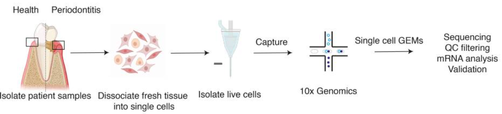

#基于scRNA-Seq研究牙周炎

19230111 徐星雨

## 背景知识

口腔粘膜是人体内分裂最快的组织之一，是抵御口腔疾病发展的第一道防线。牙龈是包围牙齿颈部的口腔粘膜，由角质化的复层鳞状上皮和下层结缔组织组成，在健康和应对机械和微生物挑战时共同协调组织内稳态。

牙周病是一种慢性炎症性疾病，与共生口腔微生物群和宿主免疫防御系统的失调有关，导致牙齿软硬支持组织的不可逆破坏。牙龈炎是一种轻微且可逆的牙龈炎症，不会永久性损害支持牙齿的组织的完整性。当未经治疗的牙龈炎发展到牙龈、骨和韧带丧失时，就会发生慢性牙周炎。

组织驻留细胞在先天免疫、免疫调节和上皮屏障维持中发挥着重要作用[1](https://www.ncbi.nlm.nih.gov/pmc/articles/PMC6196490/)。使用单细胞RNA测序技术对人类牙龈进行无偏分析，包括上皮细胞、间充质细胞和免疫细胞。为了更好地描述疾病进展的动力学特征，使用了从健康和患病患者中分离的样本。使用单细胞分析确定了牙龈组织内细胞亚群组成的差异，以及健康和患病患者样本之间转录组的变化，用于发现这些变化与进展性疾病状态的联系。

