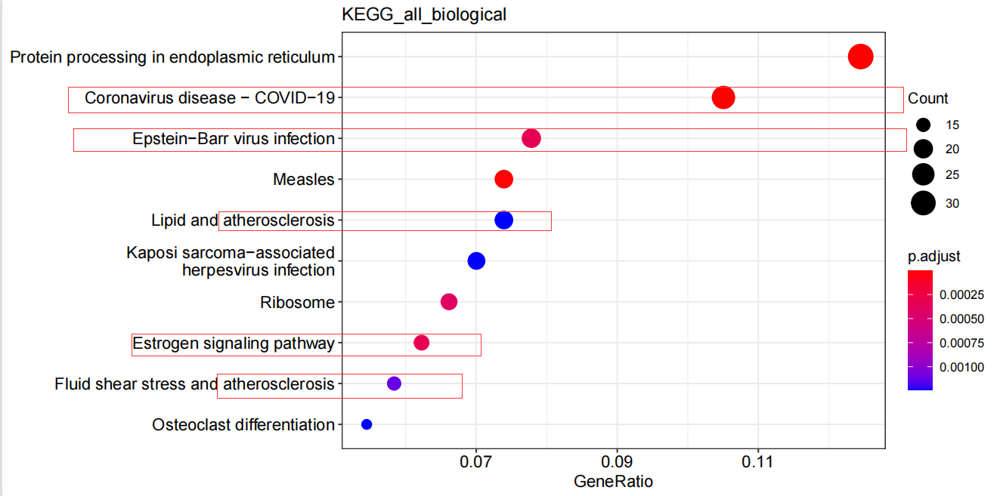
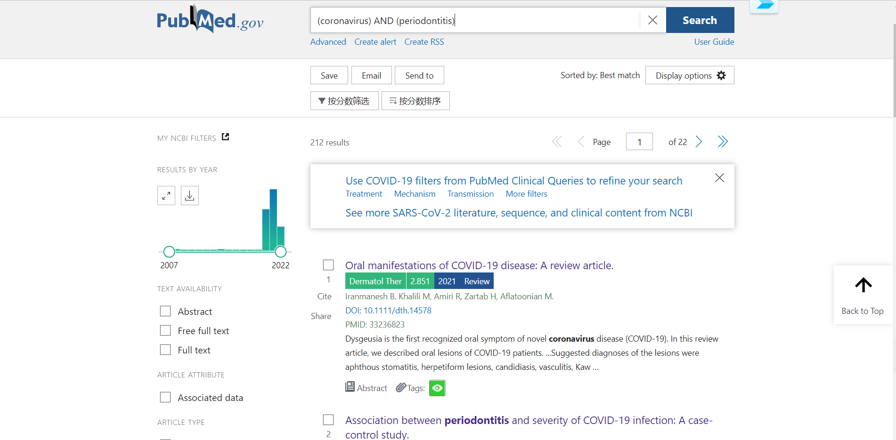
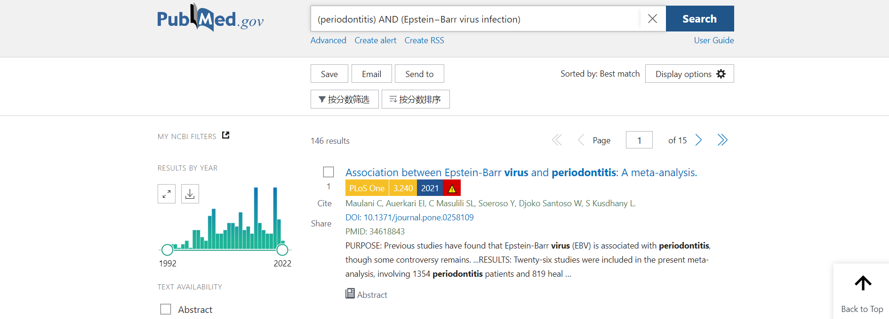
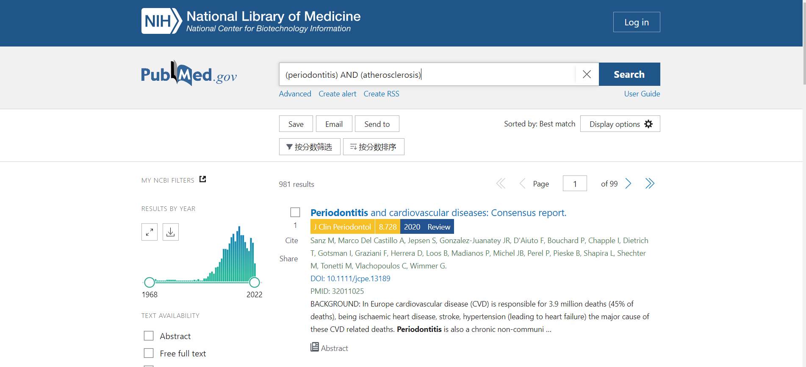
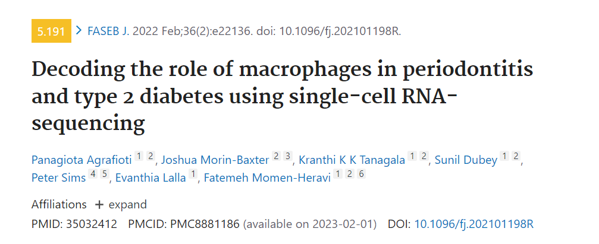

##summary
1.在转录组学水平上，细胞景观主要由细胞比例的相应变化。在健康方面，我们观察到滤泡和浆B细胞的数量很少，记忆B细胞在轻度样本和重度样本中显示出显着的增加。

2.在IgG血浆B细胞的差异基因富集分析中，富集到了冠状病毒病−covid−19、爱泼斯坦−Barr病毒感染、疱疹病毒感染、动脉粥样硬化等通路。

PubMed搜索结果：

牙周炎与ICU入院风险增加、需要辅助通气和COVID-19患者死亡以及血液中与疾病结局恶化相关的生物标志物水平升高有关。

亚组分析结果表明，EB病毒与牙周炎的相关性在亚洲、欧洲和美国人群中具有显著性（P<0.001;P = 0.04;P = 0.003，但不包括非洲人口（P = 0.29）)。

过去五年发表的总共6项病例对照和队列研究流行病学研究，这些研究表明，与没有牙周炎或不太严重的牙周炎的患者相比，临床诊断的牙周炎或更严重的牙周炎患者发生第一次冠状动脉事件的风险增加。
在美国对男性退伍军人进行的一项前瞻性队列研究报告，牙周炎（通过放射成像骨质流失的严重程度测量）与PAD在25至30年的随访期内的发病率之间存在正相关，调整后的OR为2.3。
 
疑问：已发表的关于新冠、EB、疱疹、心血管疾病与牙周炎的研究大多集中在统计学关联分析上，单细胞测序是否在其研究上能够更进一步？
在检索单细胞转录组应用于与其他疾病联合分析时，只发现了一篇文献（可能是我搜索有问题）：

由于没有权限，只能看到该篇文章的摘要：在取样的选择方面，他选择了健康人、牙周炎患者和患有T2DM的牙周炎患者的牙龈组织，研究其中的巨噬细胞，周炎中的大多数巨噬细胞表达单核细胞谱系标志物CD14，在患有T2DM的牙周炎患者的牙龈巨噬细胞中发现了RELA（NF-κB转录因子复合物的亚基）的高表达和激活。发现巨噬细胞的异质性和高炎症激活可能与牙周炎的发病机制和结果有关，并且在T2DM患者中可能进一步增强。

这边为何选择巨噬细胞？

我之前得到的富集分析结果都是基于的IgG血浆B细胞，是否可以选择这类细胞？

由于这类细胞含量在健康和患者中的含量差异巨大，结果是否可信？（由于之前的注释结果并不是很准确，我暂且尝试了注释的上皮细胞，在他的富集分析中得到了类似的结果）

再进一步亚群细分中，分成了8类，健康人的细胞类型似乎只在其中的一簇中，其他簇与这个簇之间差异基因是否可以作为药物靶基因。（但是我觉得用IgG血浆B细胞是极度不合理的，健康人中的细胞数实在太少，选这类细胞做主要是对其注释比较确信）

